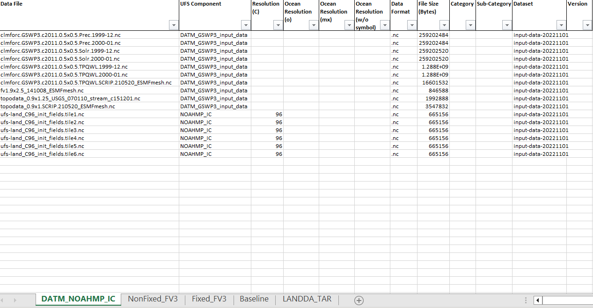
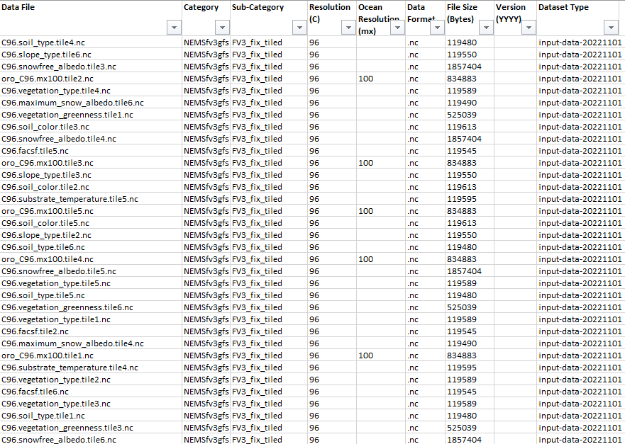
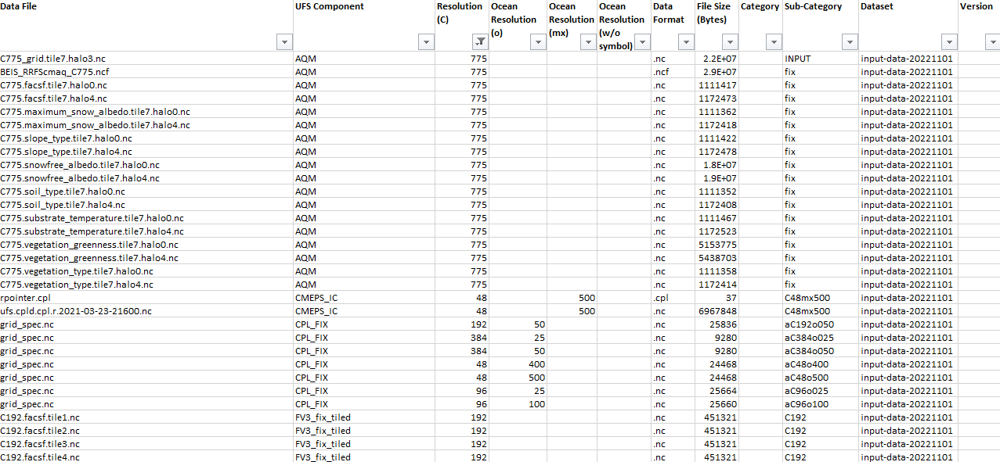
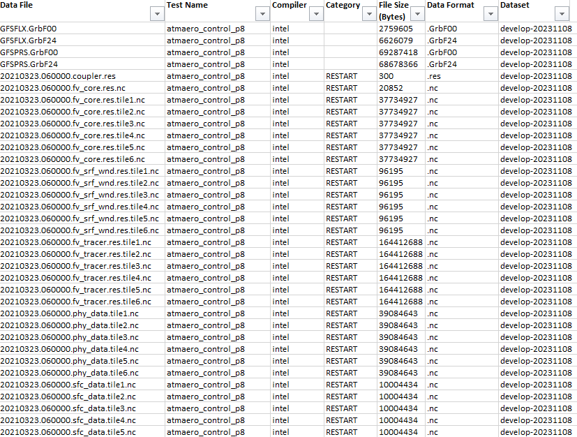

<h1 align="center">
Mapping Land DA Test Case Datasets
</h1>

    
    
    
    

<h5 align="center">
    
[About](#About) • [Prerequisites](#Prerequisites) • [Quick Start](#Quick-Start) • [Environment Setup](#Environment-Setup) • [What's Included](#What's-Included) • [Status](#Status) • [Version](#Version)

</h5>

# About

__Introduction:__

There is a need for developers/users to determine what data is required for a given Land Data Assimilation (DA) application's test case. Currently, a reference table to determine the required data does not exist. According to the current structure of the Land DA framework, the test datasets are hidden within it's the framework -- in which the data utilized for a unique test case is retrieved from within the framework's retrieved_data.py script. The script will call a unique set of data files residing within the S3 buckets designated for the Land DA application & UFS-WM RT framework.

__Purpose:__ 

The purpose of the tool is to feature extract additional information regarding the current Land DA required list of input & baseline data files needed for testing & provide users a mapping of the data files required for a given Land DA's test case.
In this demonstration, the tool will be applied against the UFS input and baseline datasets residing within the S3 buckets designated for the Land DA application & UFS-WM RT framework.

__Capabilities:__ 

This tool will be able to perform the following actions:

* Apply feature engineering to obtain additional information regarding the data files.
* Extract all data filenames mapping them to their corresponding relative directory path, root folder, filename, file format, compiler (if applicable), "input" or "restart" file type, resolution (km) category, resolution (C resolution) category.
* Categorize & sort each data file into a given UFS Weather Model Application build & Regression Test.
* Generate reference table/map of each data files to UFS Weather Model Application build & Regression Test

__Future Capabilities:__ 

This tool can be used as a skeleton framework for querying information regarding the data files as they pertain to the Land DA application's test case.

# Prerequisites
* Setting up conda environment w/in RDHPCS.
    * Refer to [Environment Setup](#Environment-Setup)
* 

# Dataset
* input-data-YYYMMDD & develop-YYYYMMDDh in ttps://noaa-ufs-regtests-pds.s3.amazonaws.com/index.html
* landda_inputs.tar.gz in https://noaa-ufs-land-da-pds.s3.amazonaws.com/index.html

# Quick Start
* In Progress

# Environment Setup

* Install miniconda on your machine. Note: Miniconda is a smaller version of Anaconda that only includes conda along with a small set of necessary and useful packages. With Miniconda, you can install only what you need, without all the extra packages that Anaconda comes packaged with:
Download latest Miniconda (e.g. 3.9 version):

    * wget https://repo.anaconda.com/miniconda/Miniconda3-py39_4.9.2-Linux-x86_64.sh

* Check integrity downloaded file with SHA-256:

    * sha256sum Miniconda3-py39_4.9.2-Linux-x86_64.sh

Reference SHA256 hash in following link: https://docs.conda.io/en/latest/miniconda.html

* Install Miniconda in Linux:

    * bash Miniconda3-py39_4.9.2-Linux-x86_64.sh

* Next, Miniconda installer will prompt where do you want to install Miniconda. Press ENTER to accept the default install location i.e. your $HOME directory. If you don't want to install in the default location, press CTRL+C to cancel the installation or mention an alternate installation directory. If you've chosen the default location, the installer will display “PREFIX=/var/home//miniconda3” and continue the installation.

* For installation to take into effect, run the following command:

source ~/.bashrc

* Next, you will see the prefix (base) in front of your terminal/shell prompt. Indicating the conda's base environment is activated. Once you have conda installed on your machine, perform the following to create a conda environment:

    * To create a new environment (if a YAML file is not provided)

        * conda create -n [Name of your conda environment you wish to create]

(OR)

    * To ensure you are running Python 3.9:

        * conda create -n myenv Python=3.9

(OR)

* To create a new environment from an existing YAML file (if a YAML file is provided):

    * conda env create -f environment.yml

*Note: A .yml file is a text file that contains a list of dependencies, which channels a list for installing dependencies for the given conda environment. For the code to utilize the dependencies, you will need to be in the directory where the environment.yml file lives.

## Activate the new environment via:

conda activate [Name of your conda environment you wish to activate]

* Verify that the new environment was installed correctly via:

    * conda info --env

*Note:

* From this point on, must activate conda environment prior to .py script(s) or jupyter notebooks execution using the following command: conda activate
    * To deactivate a conda environment:
        * conda deactivate

## Link Home Directory to Dataset Location on RDHPCS Platform

* Unfortunately, there is no way to navigate to the "/work/" filesystem from within the Jupyter interface when working on the remote server, Orion. The best way to workaround is to create a symbolic link in your home folder that will take you to the /work/ filesystem. Run the following command from a linux terminal on Orion to create the link:

    * ln -s /work /home/[Your user account name]/work

* Now, when you navigate to the /home/[Your user account name]/work directory in Jupyter, it will take you to the /work folder. Allowing you to obtain any data residing within the /work filesystem that you have permission to access from Jupyter. This same procedure will work for any filesystem available from the root directory.

*Note: On Orion, user must sym link from their home directory to the main directory containing the datasets of interest.

## Open & Run Application on Jupyter Notebook

* Open OnDemand has a built-in file explorer and file transfer application available directly from its dashboard via:

    * Login to https://orion-ood.hpc.msstate.edu/

* In the Open OnDemand Interface, select Interactive Apps > Jupyter Notbook

## Additonal Information

To create a .yml file, execute the following commands:

* Activate the environment to export:

    * conda activate myenv

* Export your active environment to a new file:

    * conda env export > [ENVIRONMENT FILENAME].yml

# What's Included
Within the download, you will find the following directories and files:
    * L
        * O
    * L
        * Out
    
* List of Dependencies: 
    * land_da_mapping.yml

# Status

    
# Version:
* Draft as of 11/06/23
